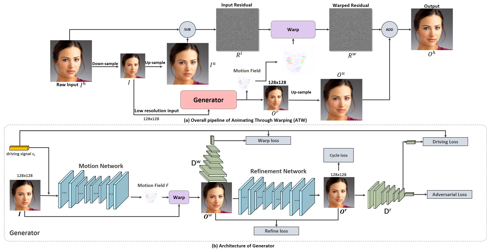

# Animating-Through-Wwarping 

<p align="left">
	
</p>

**The official pytorch implementation of ATW paper, Animating Through Warping: an efficient Method for High-Quality Facial Expression Animation**

# 

## Getting Started

### Requirements

* Python 3
* PyTorch 0.4.1
* visdom (optional, only for training with browser visualizer)
* imageio (optional, only for generating GIF image in testing)


### Installation

* Clone this repo:

```
git clone ssh://git@rnd-gitlab-ca-g.huawei.com:2222/HiLens/hicam/facial_animation.git
cd facial_animation
conda create --name <env_name> --file requirements.txt
```


### train 
* prepare the training datasets
* uncomment the corresponding items in run.sh, then run the following command:

```
bash run.sh
```

### test
* download the pretrained models from google drive
* extract the file and put the folder pretrained_ckpt/ under ./ATW/
* uncomment the corresponding items in the run.sh, then run the following command:

```
bash run.sh
```


# Some Results

## CelebA 


## EmotionNet


## RaFD


# other

Feel free to contact me if you need any help from me related to this project.


